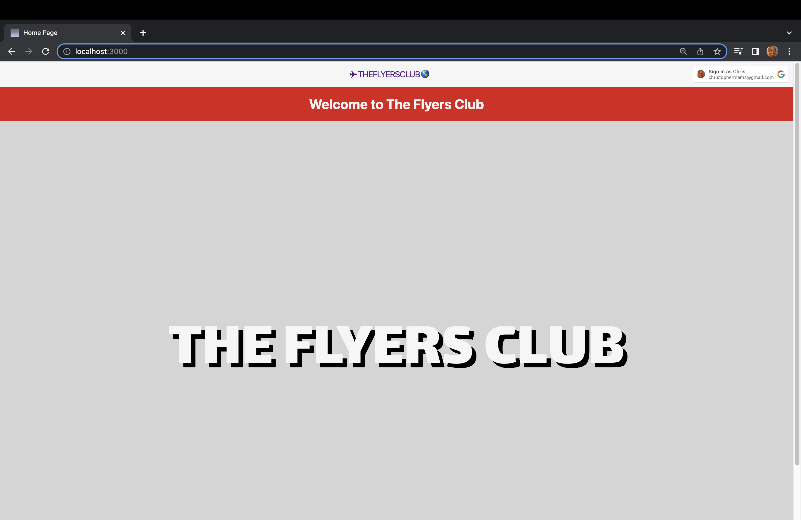
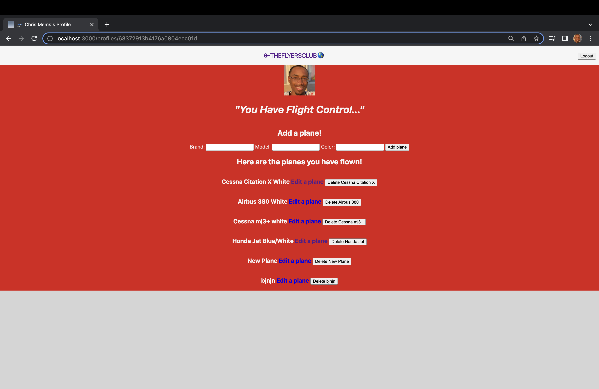
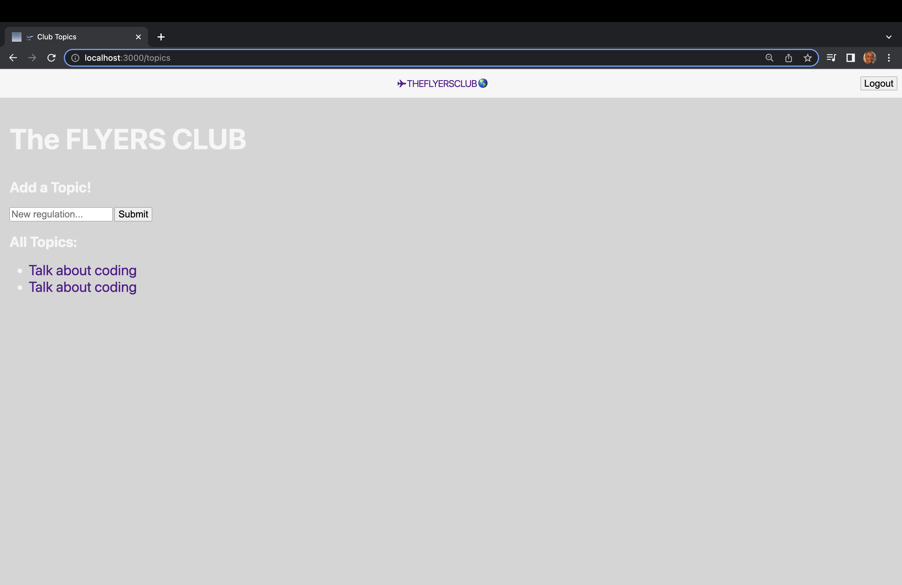

# The Flyers Club
## ReadMe
 The Flyers Club is a community where people who share a passion for aviation can meet and share their fun adventures or discuss changes in the world of aviation.

### Getting started
App: http://the-flyers-club-chris-m.fly.dev
Trello: https://trello.com/b/7woxfGGm/theflyersclub

### Technologies used
- HTML, CSS, JavaScript, MongoDB, Node.js, Google OAuth

### Next Steps
- Add feature so that users and guest can like a comment
- Create a thread for an individual comment
- Add a mobile app feature
- Change navbar icons

### Credits
- WallpaperAccess (Background Images)